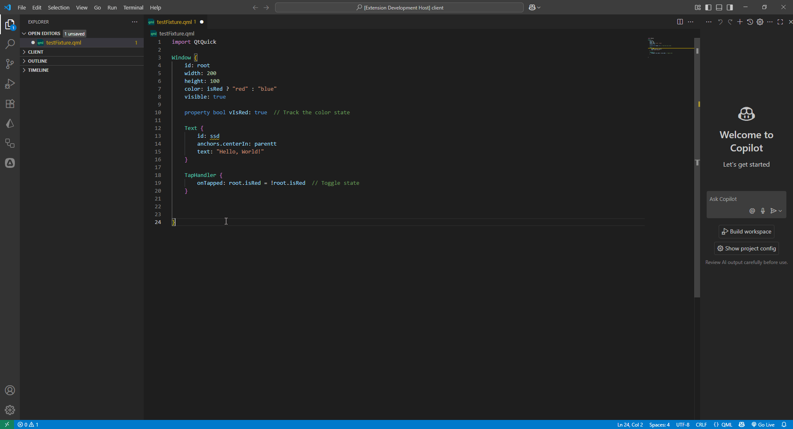

# Qmet

Qmet is a tool inspired by [Emmet](https://emmet.io/), created to let you write abbreviations in QML that are automatically expanded into full code.

## Case os uses

Now it's only used on [notus-qml-lsp](https://github.com/luizh3/notus-qml-lsp), for mor details check the project.

## Installation

Install via npm:

```bash
npm install qmet
```

or clone the repository and install dependencies:

```bash
git clone <repo-url>
cd qmet
npm install
```

## Usage

Import Qmet in your TypeScript or JavaScript project:

```ts
import { /* functions, classes, etc. */ } from 'qmet';
```

## Examples

Here are some example queries or usages:

> Nested

```
row>column>rectangle
```

```
Row {
    Column {
        Rectangle {
        
        }
    }
}
```
---

> Nested more sum

```
row>column+rectangle
```

```
Row {
    Column {
        
    }
    Rectangle {
        
    }
}
```
---

> Nested with multiplication

```
row>column+rectangle
```

```
Row {
    Row {
        
    }
    Row {
        
    }
    Row {
        
    }
}
```
---

> Only sum

```
row+column+rectangle
```

```
Row {
    
}
Column {
    
}
Rectangle {
    
}
```
---

> Multiplication and sum

```
3*row+rectangle
```

```
Row {
    
}
Row {
    
}
Row {
    
}
Rectangle {
    
}
```
---

> Nested multiplication

```
3*rectangle>row>rectangle
```

```
Rectangle {
    Row {
        Rectangle {
            
        }
    }
}
Rectangle {
    Row {
        Rectangle {
            
        }
    }
}
Rectangle {
    Row {
        Rectangle {
            
        }
    }
}
```

### Gif Example



## Dependencies

- [tree-sitter-qmet](git@github.com:luizh3/tree-sitter-qmet.git)
  - It's used for parser query on a language and convert in a AST

## License

See the LICENSE file for more information. 